<h1>Hi, I'm Kowsalya Kannan 👋</h1>
<h3>Frontend Developer · ReactJS · JavaScript · Responsive UI</h3>

 

 

## 🖥️ whoami

  

 

## 🛠️ Tech Stack

  

 

## 💼 Experience

  

 

<b>🔵 Frontend Developer — eGaisoft, Bangalore</b> &nbsp;2025 – Present

 

Developing responsive and user-friendly web interfaces using HTML5, CSS3, JavaScript, ReactJS, and Bootstrap. Building reusable ReactJS components and interactive UI features to improve application usability. Implemented dynamic data handling using React Hooks and REST APIs. Integrated WhatsApp Cloud API for messaging workflows.

<code>ReactJS</code> <code>JavaScript</code> <code>HTML5</code> <code>CSS3</code> <code>Bootstrap</code> <code>React Hooks</code> <code>REST APIs</code> <code>Git/GitHub</code>

 

## 🚀 Featured Projects

| | | |
|---|---|---|
| 🔺 **[Elai.in Order Dashboard](https://github.com/Kowsi7112/Elai-Dashboard)** | Interactive order management dashboard | `ReactJS` `React Hooks` `React-Bootstrap` |
| 🌀 **[Recent Orders Table](https://github.com/Kowsi7112/OrderTable)** | Dynamic filtering & responsive table | `JavaScript` `Conditional Rendering` |
| 🖐️ **[WhatsApp Cloud API](https://github.com/Kowsi7112/WhatsApp-API)** | Customer messaging feature integration | `REST API` `Postman` |

 

<b>📦 More project details</b>

 

| Project | Description |
|---|---|
| [Elai.in Website](https://github.com/Kowsi7112/Elai-Dashboard) | Built order summary cards (Total, Completed, Pending) with click-based filtering and delivery navigation. |
| [Recent Orders Table](https://github.com/Kowsi7112/OrderTable) | Developed responsive table with customer details, order dates, balance, and status badges. |
| [API Workflows](https://github.com/Kowsi7112/WhatsApp-API) | Implemented dynamic data handling using Postman and RESTful JSON services. |

 

## 🎓 Education & Certifications

- **B.E. Electrical and Electronics Engineering** — Vaigai College of Engineering, Anna University
- **Frontend Web Development** — LinkedIn Learning, 2024

 

## 📊 GitHub Analytics

 

 

 

📫 **Reach me:** [kowsalyakannan2021@gmail.com](mailto:kowsalyakannan2021@gmail.com) · [LinkedIn](https://linkedin.com/in/kowsalyakannan)

 

